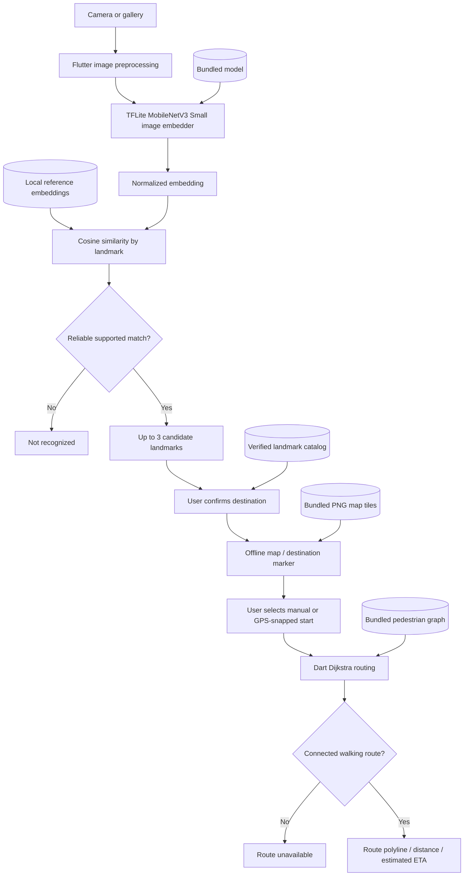

# TUNTON AI

**Snap a landmark. Confirm the place. Preview a walking route offline after map setup.**

> **Project status:** One-day hackathon MVP specification. This repository's documentation defines the intended product; individual features should only be marked as implemented after they are built and tested on a physical Android device.  
> **Platform:** Flutter / Android-first  
> **Pilot region:** Intramuros, Manila, Philippines  
> **Minimum device target:** 8 GB RAM (requires testing on actual target hardware)  
> **Current map implementation:** Bundled raster PNG tiles rendered by `flutter_map` and `AssetTileProvider`. There is no remote map SDK or map-download flow in the current app; this differs from the approved target in `docs/PRD.md`.

## Contents

- [Overview](#overview)
- [What the MVP does](#what-the-mvp-does)
- [What the MVP does not do](#what-the-mvp-does-not-do)
- [User journey](#user-journey)
- [Architecture](#architecture)
- [Technology stack](#technology-stack)
- [Getting started](#getting-started)
- [Required offline assets](#required-offline-assets)
- [How photo recognition works](#how-photo-recognition-works)
- [How offline navigation works](#how-offline-navigation-works)
- [Repository structure](#repository-structure)
- [Build and run](#build-and-run)
- [Offline verification and benchmarks](#offline-verification-and-benchmarks)
- [Troubleshooting](#troubleshooting)
- [One-day delivery plan](#one-day-delivery-plan)
- [Team workflow and coding-agent rules](#team-workflow-and-coding-agent-rules)
- [Privacy, data provenance, and attribution](#privacy-data-provenance-and-attribution)
- [Limitations and safety](#limitations-and-safety)
- [Demo walkthrough](#demo-walkthrough)
- [Documentation](#documentation)

## Overview

**TUNTON AI** is a small, offline-first mobile proof of concept for identifying **supported, recognizable landmarks in photographs** and previewing a walkable route to the selected landmark. A local vision model operates **on the Android device**; a finite catalog connects landmark matches to verified coordinates; a prepackaged pedestrian graph provides walking paths without calling an online directions service. The current map widget reads bundled PNG tiles from `assets/tiles/` using `flutter_map`'s `AssetTileProvider`.

A visitor might have a photo of an Intramuros landmark but not know the name or where it appears on a map. In the supported pilot area, TUNTON helps that visitor identify a likely landmark, confirm it, choose a manual start or explicitly request a GPS start snapped to the walking graph, and preview a route over the bundled tile map.

### Core promise

**Photo → local AI matches → user confirms destination → bundled offline tile map → manual or GPS-snapped start → walking-route preview.**

**Precision boundary:** Image matching identifies the *landmark depicted in the photograph*, **not the location where the photographer stood**. TUNTON does not infer a live current position from the photo.

### What makes the AI computation meaningful?

A bundled **MobileNetV3 Small image embedder** produces a numerical vector from the user's picture. TUNTON compares that vector with **precomputed local embeddings** of reference photographs. The AI computation runs on the phone, not on a cloud endpoint. Matching and coordinates are distinct: the model proposes landmark candidates, while verified catalog data supplies location coordinates.

## What the MVP does

| Requirement | Behavior | Priority |
|---|---|---|
| Photo input | Take a picture or select one from the gallery | P0 |
| Image recognition | Run one bundled TFLite image-embedding model locally | P0 |
| Landmark retrieval | Rank **up to three distinct** supported landmarks | P0 |
| Uncertainty | Return **Not recognized** when a photo cannot be matched reliably | P0 |
| Confirmation | Require the user to confirm a landmark before routing | P0 |
| Current map | Render bundled raster PNG tiles from `assets/tiles/` using `flutter_map` | Implemented locally; does not meet the map-provider target in `docs/PRD.md` |
| Starting point | Choose a manual graph-backed start or explicitly request a GPS start snapped to the graph | P0 |
| Route preview | Calculate a shortest connected pedestrian route on-device | P0 |
| Route result | Display path geometry, distance, and estimated walking duration | P0 |
| Error handling | Explain unsupported inputs, missing assets, and disconnected routes | P0 |
| Offline proof | Cold-launch and complete the workflow in airplane mode | P0 |

**Demonstration dataset:** Start with **six verified landmarks** in Intramuros and approximately **3–5 labeled reference photos per landmark**. Set aside different, unseen photos for testing. This is a deliberate finite-area proof of concept, **not** general-purpose image geolocation.

## What the MVP does not do

The following are **out of scope for the hackathon** and must not be quietly added by contributors or coding agents:

- General-purpose photo geolocation throughout Manila, the Philippines, or the world.
- Background GPS tracking, automatic rerouting, turn-by-turn voice guidance, live traffic, or road closure updates. Foreground GPS is optional and does not reroute.
- EXIF GPS interpretation, OCR, sign reading, geocoding, and additional map regions beyond the fixed P0 Intramuros region.
- Driving/cycling directions, wheelchair-accessibility guarantees, or safety-certified navigation.
- Chatbots, large language models, a second AI model, or model training/fine-tuning.
- Hosted app servers, FastAPI, cloud AI/directions APIs, remote databases, user authentication/accounts, app-owned analytics, or syncing.
- iOS-specific demo work during the Android-first one-day build.

Do not add extra screens, architecture layers, or dependencies “for future scalability.” The single P0 user journey is the product.

## User journey

1. The current build reads its bundled raster tiles locally; it has no map-download step.
2. Enable airplane mode and cold-launch TUNTON.
3. Select **Take Photo** or **Choose Photo**.
4. The phone preprocesses the picture and runs the embedded TFLite vision model.
5. TUNTON compares the resulting embedding against bundled landmark reference vectors.
6. The screen displays up to three **different** potential landmark matches or **Not recognized**.
7. The user confirms one potential landmark as the **destination**.
8. The local tile map places a marker at that landmark's **verified stored coordinates**.
9. The user selects a valid starting landmark or requests a GPS start snapped to a graph node.
10. The on-device routing engine calculates the shortest connected **walking** path.
11. The app displays the route polyline, distance, and **estimated** walking duration.

If the image is not recognized, the app does **not** fabricate coordinates. If the selected points are disconnected, it displays **Route unavailable** instead of drawing a straight line.

## Architecture

The app bundles the model, recognition data, pedestrian graph, and raster map tiles under `assets/tiles/`. The current map is rendered by `flutter_map` from local PNG assets; the repository does not implement the SDK-managed offline-region target described in `docs/PRD.md`. Python may be used **beforehand** to prepare the pedestrian graph and reference data on a developer's Mac; there is **no Python or application server in the deployed Android app**.



All core processing occurs in the Flutter app:

- **Recognition:** Dart preprocessing → `tflite_flutter` inference → Dart cosine-similarity ranking.
- **Mapping:** `flutter_map` with `AssetTileProvider` reading bundled PNG raster tiles.
- **Routing:** A compact pedestrian graph plus a pure-Dart Dijkstra traversal over actual edge lengths and geometry.
- **Data:** Read-only bundled model, JSON, images, graph, and raster map tiles.

## Technology stack

| Layer | Approved choice | Role |
|---|---|---|
| App/UI | Flutter + Dart | Android application and the one-screen-flow state transitions |
| State | `flutter_riverpod` | Current photo, match, destination, origin, and route |
| Image selection | `image_picker` | Capture/select one photo |
| Preprocessing | Dart `image` | Decode, orient, resize, and prepare tensors as required by the checkpoint |
| Model/runtime | **MobileNetV3 Small Image Embedder** `.tflite` + `tflite_flutter` | Device-local image embeddings |
| Similarity | Dart cosine similarity | Rank bundled reference vectors by landmark |
| Map display | `flutter_map` + `AssetTileProvider` | Render bundled `assets/tiles/{z}/{x}/{y}.png` tiles, markers, and route geometry |
| Route computation | Pure Dart Dijkstra | Shortest connected pedestrian path |
| App assets | Bundled JSON, photos, model, and raster tiles | Read-only local resources; no map download step in the current app |
| Preparation only | Python + OSMnx | Convert/validate pedestrian data before bundling APK |

**No Ollama, TensorFlow server, OpenCLIP runtime, vector database, Firebase, Supabase, or Google Maps API is required or approved for this MVP.**

## Getting started

> **For co-developers:** [`docs/SETUP.md`](docs/SETUP.md) is the authoritative, step-by-step environment and asset-preparation guide. The quick-start below is intentionally shorter and **does not replace** the asset validation instructions.

### Prerequisites

- MacBook Air M5 or other supported development computer with **Flutter**, **Dart**, **Git**, **Android Studio**, and **Android SDK Platform-Tools** installed.
- A physical Android phone for the demo, with USB debugging enabled; **8 GB RAM target** and an Android API level compatible with the selected `tflite_flutter` package (the current setup document specifies **API level 26+**).
- Internet during initial tool/model/data preparation; the current app map reads bundled tiles locally.
- Properly sourced images, a prepackaged Intramuros pedestrian graph, and the bundled raster tiles.

Check your environment:

```bash
flutter --version
flutter doctor -v
flutter doctor --android-licenses
flutter devices
adb devices
```

Ensure the Android device appears as **authorized** before continuing. Resolve Android toolchain errors before investing the remaining hackathon time in the UI.

### Open or create the app

If the team already has a Flutter project, **open that project**; do not overwrite it.

For a brand-new repository only:

```bash
flutter create --platforms=android tunton
cd tunton
```

Add only the already approved runtime dependencies:

```bash
flutter pub add tflite_flutter image_picker image flutter_map flutter_riverpod
flutter pub get
```

Place the governing Markdown documents in the repo root, and place the **actual**, validated offline assets at the paths listed below. Merely installing packages is not enough to make image recognition or an offline map work.

## Required offline assets

| Asset | Expected path | Why it is required |
|---|---|---|
| Vision model | `assets/models/landmark_embedder.tflite` | One local image-embedding checkpoint |
| Landmark catalog | `assets/landmarks/landmarks.json` | Verified names, IDs, coordinates, route entry nodes |
| Visual index | `assets/landmarks/reference_embeddings.json` | Reference embeddings generated with the **same** checkpoint and preprocessing |
| Photo references | `assets/images/` | Properly licensed, labeled landmark images |
| Route graph | `assets/maps/intramuros_graph.json` | Verified pedestrian nodes, edge lengths, and geometry |
| Current raster map | `assets/tiles/{z}/{x}/{y}.png` | Bundled PNG tiles read by `flutter_map`'s `AssetTileProvider` |

### Bundled image model

The approved image-embedder model can be obtained **during preparation** from the published MediaPipe model-hosting path:

```bash
mkdir -p assets/models
curl -fL \
  'https://storage.googleapis.com/mediapipe-models/image_embedder/mobilenet_v3_small/float32/1/mobilenet_v3_small.tflite' \
  -o assets/models/landmark_embedder.tflite
```

**Mandatory verification:** Inspect the model's real input/output tensor dimensions, dtype, channel layout, normalization, and output meaning using the installed TFLite runtime. A normal MobileNet classifier's class logits are **not** landmark embeddings. A raw TFLite interpreter does **not** automatically reproduce MediaPipe Task preprocessing.

### Landmark and reference-vector data

The fixed `landmarks.json` fields are `id`, `name`, `lat`, `lon`, and `route_node_id`. Coordinates must be verified, in the supported area, and associated with a pedestrian graph node at a reachable entrance.

The reference index includes `model_id`, `dimension`, and `references` with `landmark_id`, `image_asset`, and a complete vector. **Generate these vectors with exactly the bundled model and its runtime preprocessing**, normalize them, and validate they are finite and have the actual model output dimension. Do not use random vectors or placeholder coordinates in the released APK.

### Walking network and current map

Prepare the **walking** graph on the Mac before the demo, using the existing `tools/prepare_dataset.py` preparation responsibility and, where useful, OSMnx. The app consumes only the exported bundled JSON and does not need OSMnx on the phone. The map screen currently uses `flutter_map` with `AssetTileProvider` to read raster PNG tiles packaged under `assets/tiles/`; it also displays markers and the pedestrian graph route overlay.

Graph geometry uses **`[latitude, longitude]`** pairs as specified in [`docs/ARD.md`](docs/ARD.md); this differs from GeoJSON's usual `[longitude, latitude]`. Each edge needs a real mapped pedestrian geometry and a positive `length_m` value. Confirm a connected test route between two catalog landmarks.

The current map implementation bundles raster tiles as assets and reads them locally; it has no remote map SDK, token, or basemap network fallback. Keep **© OpenStreetMap contributors** attribution visible. Verify the tile source and redistribution terms before public release; repository presence alone does not establish licensing permission.

### Flutter asset registration

Declare the real model, JSON, image, and tile files under the single existing `flutter: assets:` section in `pubspec.yaml`. See [`docs/SETUP.md`](docs/SETUP.md#4-register-bundled-assets-in-pubspecyaml) for the exact procedure.

A current build includes the **model, reference index, verified catalog, walking graph, and raster tile assets** in the app bundle. Confirm map coverage and airplane-mode behavior on the target device; a successful build alone does not prove them.

## How photo recognition works

1. Read one selected photo through `image_picker`.
2. Decode and preprocess it in Dart, following the **verified** TFLite tensor contract.
3. Reuse one model interpreter and run inference on-device.
4. Extract and normalize the resulting **embedding** vector.
5. Compare against bundled, normalized reference vectors with cosine similarity.
6. Aggregate by landmark ID (for example, keep the highest reference similarity per landmark).
7. Rank at most **three different landmarks**; require user confirmation.
8. If the evidence is weak or ambiguous, return **Not recognized**.

**Do not label cosine similarity as a calibrated probability or GPS accuracy percentage.** An appropriate unknown-match rejection rule must be evaluated with held-out supported and unsupported photos. The app must never produce location coordinates from the model's vector directly.

## How offline navigation works

The user-confirmed landmark is the **destination**. The user picks a manual mapped start or explicitly requests GPS snapping to the nearest graph node. The photo never supplies the user's position.

1. Resolve both selections to known `route_node_id` entries.
2. Reject invalid or out-of-region points.
3. Run Dijkstra on bundled pedestrian edges, weighted by `length_m`.
4. If connected, reconstruct the **actual ordered edge geometry** for the map polyline.
5. Sum edge lengths to calculate distance.
6. Display an approximate walking ETA using a fixed **4.5 km/h** pace, equivalent to **75 meters/minute**.
7. If disconnected, return **Route unavailable**. Do **not** draw a straight-line replacement.

The resulting route is a **preview based on a preloaded pedestrian graph**, not turn-by-turn navigation or automatic rerouting. A GPS-to-node connector is approximate and may not be walkable.

## Repository structure

Use the exact, scope-locked MVP shape from [`docs/ARD.md`](docs/ARD.md). Standard Flutter-generated configuration/build files may also exist. Do not add architecture folders merely because they would be typical for a larger application.

```text
tunton/
├── README.md
├── AGENTS.md
├── SKILL.md
├── docs/
│   ├── README.md
│   ├── DEVELOPMENT_MAP.md
│   ├── PRD.md
│   ├── ARD.md
│   ├── ARCHITECTURE.md
│   └── SETUP.md
├── lib/
│   ├── main.dart
│   ├── app/app.dart
│   ├── features/
│   │   ├── camera/photo_screen.dart
│   │   ├── recognition/
│   │   │   ├── embedding_service.dart
│   │   │   ├── landmark_matcher.dart
│   │   │   └── recognition_screen.dart
│   │   ├── map/
│   │   │   ├── offline_map_screen.dart
│   │   │   └── landmark_markers.dart
│   │   └── navigation/
│   │       ├── routing_service.dart
│   │       └── navigation_screen.dart
│   └── shared/models/
│       ├── landmark.dart
│       └── route_result.dart
├── assets/
│   ├── models/landmark_embedder.tflite
│   ├── landmarks/
│   │   ├── landmarks.json
│   │   └── reference_embeddings.json
│   ├── maps/intramuros_graph.json
│   └── images/
├── tools/prepare_dataset.py   # Development-time preparation only
├── android/                  # Flutter-generated
└── pubspec.yaml
```

The paths above describe the **approved implementation layout**, not evidence that all source files and assets have already been created.

## Build and run

From the Flutter project root, with a connected and authorized physical Android device:

```bash
flutter pub get
flutter analyze
flutter devices
flutter run -d <android-device-id>
```

Replace `<android-device-id>` with a real device identifier. **Run only after mandatory assets are present.**

For the final standalone Android demo:

```bash
flutter analyze
flutter build apk --release
adb install -r build/app/outputs/flutter-apk/app-release.apk
```

The expected Flutter output path is `build/app/outputs/flutter-apk/app-release.apk`. Confirm the APK installs and **cold-launches on the phone**; a successful `flutter build` alone is not the offline acceptance test. Android build/signing prerequisites must also be satisfied.

## Offline verification and benchmarks

**Required test: physical Android phone, release APK, airplane mode, cold start.** Turn off both Wi-Fi and mobile data and disconnect any dependency on the developer Mac. No runtime map/model downloads are allowed.

### End-to-end acceptance checklist

- [ ] Release APK installs on the target Android phone.
- [ ] App cold-launches with airplane mode enabled.
- [ ] Camera or gallery provides a valid photo without network access.
- [ ] TFLite runs **on-device**, using the bundled checkpoint.
- [ ] An **unseen** photo of a supported landmark gives plausible distinct candidates.
- [ ] An unsupported/ambiguous photo can produce **Not recognized**.
- [ ] User explicitly confirms a candidate destination.
- [ ] The bundled raster tiles, labels, and markers render in airplane mode after a cold launch.
- [ ] Manual or GPS-snapped start resolves to a valid pedestrian graph node.
- [ ] A connected route follows real pedestrian edges and shows distance/ETA.
- [ ] An unconnected route returns **Route unavailable**.
- [ ] No Mac, server, or internet dependency is needed during the journey to load the bundled map tiles.
- [ ] Actual device model, Android version, memory use, and timings are recorded.

### Performance evidence to record

| Metric | How to report it |
|---|---|
| Device and RAM | Phone model, Android version, and installed memory |
| Recognition | Time for a single image, including whether inference/preprocessing is counted |
| Retrieval correctness | Results on **held-out** photos; show unsupported-photo outcomes |
| Routing | Time to compute a connected route for the supported graph pair |
| Memory | Idle/inference/map memory snapshots; label sampled figures accurately |
| Offline | Airplane-mode release test **passed / failed / not run** |

For memory inspection, identify the Android app's real application ID from its generated Gradle project, then run:

```bash
adb shell dumpsys meminfo <application-id>
```

Sample during relevant stages. `dumpsys meminfo` gives **snapshots**, not an automatic true peak; repeated samples should be described as **highest observed sample**. Successful testing on a phone with more than 8 GB RAM is **not proof** of 8 GB compatibility. Be explicit if an actual 8 GB device could not be tested.

## Troubleshooting

| Symptom | In-scope check |
|---|---|
| Flutter or Android toolchain not ready | Run `flutter doctor -v`; install SDK components and accept Android licenses. |
| Phone missing or unauthorized | Verify USB debugging, cable, authorization prompt, `flutter devices`, and `adb devices`. |
| Model fails to load | Check `.tflite` file, asset registration, platform compatibility, and Android logs. |
| Matches appear random | Check model tensor preprocessing/output, reference checkpoint consistency, vector normalization, and unseen test photos. |
| App has a blank map offline | Verify tile paths exist in the Flutter asset bundle and the camera stays within bundled tile coverage. |
| Route is a straight line or missing | Check mapped entrance nodes, edge geometry, coordinate order, connectivity, and path reconstruction. |
| App fails in airplane mode | Find the unbundled asset or forbidden network dependency; do **not** insert a cloud fallback. |
| Memory is excessive | Keep one TFLite interpreter and one photo inference at a time; shrink assets to the pilot region. |

The full setup and troubleshooting details are in [`docs/SETUP.md`](docs/SETUP.md).

## One-day delivery plan

| Timebox | Deliverable |
|---|---|
| **Hour 0–1** | Device ready, Flutter app opens, model/map assets sourced, six landmark records selected |
| **Hour 1–3** | Independent on-device embedding lookup, graph shortest path, and offline map rendering |
| **Hour 3–5** | Integrated photo → ranked candidates → confirmation → map → manual or GPS-snapped origin → route |
| **Hour 5–6** | Unknown-photo, invalid-asset, out-of-bounds, and route-unavailable states |
| **Hour 6–7** | Release APK installed; cold airplane-mode run; recognition, routing, and memory measurements |
| **Hour 7–8** | Fix blockers, verify asset attribution, and rehearse the final demo |

**Stop rule:** After the P0 workflow functions, spend the remaining time on reliability, tests, and presentation. Do not add P1/P2 features.

## Team workflow and coding-agent rules

| Workstream | Expected handoff |
|---|---|
| Vision | Verified MobileNetV3 embedder, real tensor contract, reference embeddings, held-out example result |
| Map and data | Verified landmark catalog, bundled raster tile coverage, connected pedestrian graph with real geometry |
| Flutter UI/integration | Photo, candidate confirmation, offline map, manual/GPS-snapped start, and route preview screens |
| QA/demo | Release APK, airplane-mode cold-run evidence, unsupported-input checks, real measurements |

**Before making a code change:**

1. Read [`docs/PRD.md`](docs/PRD.md) for the P0 acceptance criterion.
2. Read [`docs/ARD.md`](docs/ARD.md) for the designated files/data contracts.
3. Apply [`AGENTS.md`](AGENTS.md) to reject out-of-scope work.
4. Follow [`SKILL.md`](SKILL.md) for the relevant implementation/test procedure.
5. Never claim a test passed if it was not executed.

Co-developer handoff format:

```text
P0 requirement(s):
Existing files changed:
Inputs/assets delivered:
Commands/tests executed and observed result:
Offline Android release test: passed / failed / not run
8 GB memory evidence: measured / not measured
Remaining blocker:
```

## Privacy, data provenance, and attribution

- **Photo privacy:** Photos and inference stay on the phone; they are never uploaded. TUNTON has no app-owned analytics.
- **Data provenance:** Supported landmarks have verified names/coordinates and legitimate reference-image rights. Vector files are generated from the matching, approved local model.
- **Geographic integrity:** Pedestrian graph paths use actual verified walking connections, not AI-invented coordinates or roads.
- **Map/tile source and rights:** The current implementation bundles raster PNG tiles under `assets/tiles/`. Verify their source and redistribution rights before public release.
- **Attribution:** Show **© OpenStreetMap contributors** for the locally rendered map and pedestrian graph data.

The current map uses `flutter_map` and local assets; it has no remote basemap service or map token configuration.

## Limitations and safety

TUNTON is a **bounded hackathon proof of concept**:

- It recognizes only its **prepackaged reference landmarks**, and similar scenes may produce ambiguous candidates.
- It finds the landmark shown, **not the camera's true position**.
- Foreground GPS may show the current location or provide an explicitly requested snapped start. It does not provide automatic off-route detection, rerouting, traffic, closure information, or real-time pedestrian access checks.
- Mapped paths may be outdated, closed, gated, or inaccessible. The app must not present a calculated route as guaranteed safe.
- Routes and walking times are approximate **previews**, not safety-critical navigation instructions.
- Missing photos, unknown landmarks, missing tile assets, or graph disconnections must produce transparent failure states.
- Compatibility with 8 GB RAM Android devices is a **target pending device testing**, not a guaranteed result.

## Demo walkthrough

1. **Use the bundled map.** The current app reads its raster tiles from assets and has no map-download step.
2. **Start offline.** Put the phone in airplane mode, confirm Wi-Fi/mobile data are off, and cold-launch the release APK.
3. **Choose a new photo.** Select a held-out photograph of one supported Intramuros landmark.
4. **Show on-device recognition.** Let TUNTON rank candidates and confirm the intended destination.
5. **Display the local map.** Show the destination marker and choose a valid manual start or explicitly request a GPS-snapped start.
6. **Calculate the walk.** Present the route along real pedestrian geometry with distance and approximate ETA.
7. **Show a limitation honestly.** Test an unsupported image (**Not recognized**) or disconnected pair (**Route unavailable**).
8. **Close with evidence.** Report observed inference/route timings, device RAM, and that the current basemap is bundled locally.

**Suggested pitch:**

> *What if a photo were enough to find a familiar destination, even when cloud AI and connectivity disappear? TUNTON runs visual landmark recognition directly on the phone, connects confirmed places to local map and pedestrian data, and previews a walking route without internet.*

## Documentation

These files are the governing project references; this README is an entry point, **not a change of scope**.

| File | Purpose |
|---|---|
| [`docs/PRD.md`](docs/PRD.md) | **Source of truth for P0 product requirements, boundaries, and acceptance** |
| [`docs/ARD.md`](docs/ARD.md) | Approved architecture, repository structure, and bundled data contracts |
| [`docs/ARCHITECTURE.md`](docs/ARCHITECTURE.md) | Visual runtime boundaries and data flow |
| [`docs/SDD.md`](docs/SDD.md) | Android-first software design, P0 traceability, current implementation, and verification strategy |
| [`docs/SETUP.md`](docs/SETUP.md) | Complete developer onboarding, model/map preparation, Android build, and offline test guide |
| [`AGENTS.md`](AGENTS.md) | Strict coding-agent scope and change rules |
| [`SKILL.md`](SKILL.md) | On-device vision/map/routing implementation and verification procedure |
| [`docs/README.md`](docs/README.md) | Documentation index and reading order |
| [`docs/DEVELOPMENT_MAP.md`](docs/DEVELOPMENT_MAP.md) | Current checkout versus approved Flutter code tree and P0 ownership map |

### Official technical references

- [Flutter documentation](https://docs.flutter.dev/)
- [`tflite_flutter` package](https://pub.dev/packages/tflite_flutter)
- [MediaPipe Image Embedder example](https://github.com/google-ai-edge/mediapipe-samples-web/blob/main/src/tasks/image-embedder.ts)
- [OSMnx documentation](https://osmnx.readthedocs.io/)

---

**Current implementation:** One Flutter Android app, one local image-embedding model, one verified landmark catalog, bundled raster PNG map tiles rendered through `flutter_map`, and one local pedestrian graph for the photo-to-walking-route preview. **No runtime server or cloud AI.** The map target in `docs/PRD.md` is not implemented by the current map widget.
