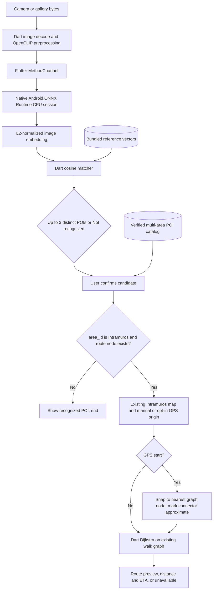

# TUNTON AI Architecture

**Status:** Approved scope update, 2026-10-10. This document explains the contracts in `PRD.md` and `ARD.md`; those remain authoritative.

## Product boundary

The app recognizes named points of interest in Manila, Makati, and Pasay. It does not infer the photographer's location from a photo. After a candidate is explicitly confirmed, the app shows the verified catalog entry. Only POIs inside the existing Intramuros route coverage continue to the existing map and Dart walking-route flow. Users may choose a manual start or explicitly opt in to foreground GPS, which is snapped to the nearest Intramuros graph node. New areas receive no map packs or routing graph.

The app has no runtime backend. Python is a developer-machine preparation tool, not a phone service. Photos remain on device. OCR is excluded.

## Runtime flow

## Model and preprocessing

| Property | Contract |
|---|---|
| Checkpoint | OpenCLIP `ViT-B-32`, `laion2b_s34b_b79k` |
| Export | Image tower only; fixed batch of one; ONNX opset recorded in export manifest |
| Runtime | `com.microsoft.onnxruntime:onnxruntime-android`, CPU first, one reusable session |
| Android boundary | Existing `EmbeddingService` sends one preprocessed tensor through a MethodChannel; native code validates its exact byte count and tensor shape before inference |
| Output | Export-inspected feature dimension, finite and non-zero; Dart L2-normalizes before matching |
| Preprocessing | Must be the exact OpenCLIP transform returned for this tagged checkpoint. Version, resize/crop, interpolation, channel order, mean/std and input/output tensor metadata are recorded alongside the ONNX checksum. No guessed transform or cross-model vectors. |

The exported ONNX model and reference index form one versioned unit. A checksum or preprocessing mismatch makes recognition unavailable. Do not retain the legacy MobileNet model as a fallback. If Android ONNX inference fails, stop and report the failure.

## Catalog and dataset

Every catalog item has a globally unique ID, exact display name, verified latitude/longitude, and `area_id` (`manila`, `makati`, `pasay`, or `intramuros`). Only Intramuros POIs may carry a `route_node_id`, and that value must resolve in the current walk graph. Recognition-only items omit the route node. Catalog coordinates come from checked authoritative/map evidence, never from model output.

The source manifest stores the exact catalog ID, source/page URL, direct download URL, author, reuse license and license URL, modifications, original and normalized SHA-256, split, and Philippine geographic evidence. Use 3–5 licensed reference images per POI. Held-out and unknown images are separate source photos and never enter the bundled app assets. Do not create placeholder vectors or represent scores as confidence probabilities.

`tools/prepare_dataset.py` owns source validation, exact model loading, reference-vector generation, catalog/index validation, held-out/unknown evaluation, and the existing Intramuros graph preparation. It stages complete outputs and refuses unsafe overwrites. It must not fetch images without an explicit source record and verified rights.

## Routing and map

The existing map, graph, route-node schema, manual origin selection, Dart Dijkstra, edge geometry, ETA and map provider remain. An explicitly requested GPS origin snaps to its nearest graph node. The connector from the measured coordinate to that node is straight-line distance and must be labeled approximate, not verified walkable geometry; only the remaining path follows the graph. A recognized POI without an Intramuros route node cannot enter routing. Never route outside Intramuros or substitute a straight line for the graph path. Existing map/download/offline limitations remain governed by `PRD.md` and the implementation evidence; adding map packs is out of scope.

## Reliability and failure behavior

| Failure | Behavior |
|---|---|
| Missing/corrupt ONNX asset, checksum mismatch or session failure | Recognition unavailable; do not fall back to network or a second model |
| Wrong input shape/type, decode error or non-finite output | Show a photo/model error; discard the result |
| Invalid/mismatched reference index | Recognition unavailable; never interpret stale embeddings |
| No candidate passes the validated rejection rule | Not recognized |
| User has not confirmed | Do not select or route a destination |
| Non-Intramuros catalog item | Show recognition result only |
| Intramuros route node missing or disconnected | Location/route unavailable; no guessed node or straight-line fallback |

Serialize inference calls, bound input image bytes/pixels, and retain no image after the recognition flow needs it. Log timings and failure classes in debug mode without image bytes or embedding vectors. Measure model size, inference latency, and peak memory on physical Android; the 8 GB requirement is not established by emulator results.

## Delivery gates

1. Export model; inspect ONNX metadata; compare host ONNX output to the pinned OpenCLIP image encoder on deterministic inputs.
2. Prove Android CPU inference via the Flutter MethodChannel, including invalid input and missing-asset failures.
3. Generate references with the same model and transform; evaluate held-out and unknown images with a recorded threshold/evaluation report.
4. Add only catalog POIs whose coordinates and image rights are verified. Recognition outside Intramuros ends after confirmation.
5. Run Flutter checks and an Android release build; physical-device, airplane-mode, and 8 GB claims require their own measurements.
