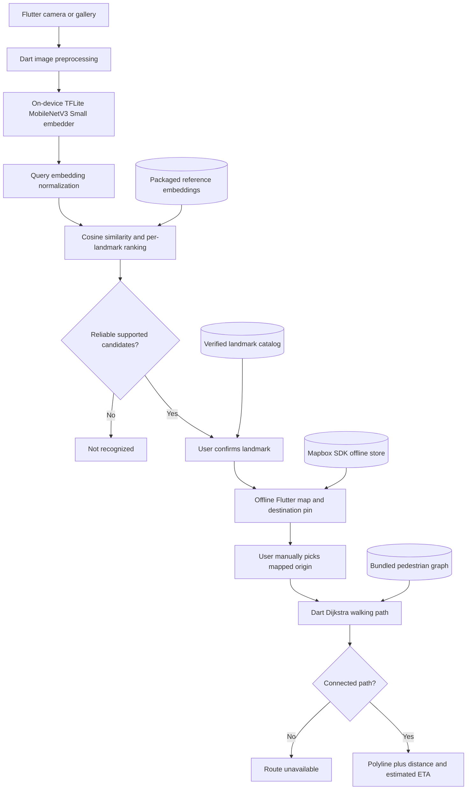

# ARCHITECTURE — TUNTON AI Flutter Offline MVP

**Authority:** Visual explanation of `PRD.md` P0 and `ARD.md` contracts, not a second set of product requirements. **Platform:** One Android phone. **Data coverage:** Fixed Intramuros pilot area. **Offline rule:** After the Mapbox region has been downloaded, the phone needs neither internet nor a running Mac/backend for the demo journey.

## 1. System boundaries

The product runtime is one Flutter APK using the Mapbox Flutter SDK. The app downloads Mapbox style/region data from Mapbox while connected; map data remains in the SDK-managed device store and is not part of the APK. Its offline journey comprises:

- Flutter UI (photo → candidates → offline map → route preview).
- **One** packaged image embedding checkpoint executing through `tflite_flutter`.
- A small, local set of verified landmark metadata and precomputed reference embeddings.
- Mapbox style and fixed Intramuros region downloaded through `mapbox_maps_flutter` while connected, then rendered from Mapbox's SDK-managed offline store.
- A finite, local pedestrian graph and **pure Dart Dijkstra** route search.

A Python/OSMnx preparation step may run on a developer's Mac to create the local model index, catalog, and pedestrian graph, but never serves requests to the phone. Mapbox map data is downloaded by the SDK on-device and is not produced by the preparation pipeline.



**Do not add:** app-owned external server, online map fallback after setup, geocoder, user login, cloud AI call, live GPS feed, camera-based AR, or a second inference pipeline. Mapbox network access is limited to preparing/updating its offline region while connected.

## 2. Model integration architecture

### Primary model path (only P0 option)

| Decision | Contract |
|---|---|
| Checkpoint | Google MediaPipe **MobileNetV3 Small Image Embedder** |
| Official binary | https://storage.googleapis.com/mediapipe-models/image_embedder/mobilenet_v3_small/float32/1/mobilenet_v3_small.tflite |
| Phone path | `assets/models/landmark_embedder.tflite` |
| Flutter entry | `lib/features/recognition/embedding_service.dart` |
| Runtime | `tflite_flutter`; use one interpreter; CPU-first |
| Expected function | Produce an embedding vector for one preprocessed photo |
| Coordinates | **Never** produced by the model; obtained only by catalog ID lookup |

**Tensor validation comes before any UI integration:** Examine model metadata and actual tensor shapes/dtypes; establish RGB decoding, resize/crop, pixel scale and normalization. High-level MediaPipe documentation is **not** a substitute for checking raw TFLite inputs. Confirm a usable embedding output, not classifier logits. Compute the reference index using **the identical checkpoint and preprocessing** as the installed app.

### MobileCLIP: replacement candidate, not an additional architecture layer

The Hugging Face repository https://huggingface.co/anton96vice/mobileclip2_tflite publishes a **community-converted MobileCLIP-S1** TFLite checkpoint (`mobileclip_s1_datacompdr_last.tflite`). Its availability does **not** establish that it exposes the desired image embedding through your exact Flutter runtime. Its ~340 MB file size adds packaging cost.

- **P0 state:** Not bundled; no model selector, second interpreter, model-specific screens, or multi-model interfaces.
- **Only allowed reassessment:** If held-out photo tests make MobileNetV3 inadequate, team explicitly decides to **replace** it, verifies candidate image-output compatibility and licensing, and re-indexes all reference photos.
- **Never blend** MobileNetV3 and MobileCLIP embedding vectors or describe Apple's official MobileCLIP2-S0 PyTorch checkpoint as TFLite-ready.

## 3. User interaction sequence

```mermaid
sequenceDiagram
    actor User
    participant UI as Flutter UI
    participant AI as TFLite embedder (phone)
    participant Index as Local landmark files
    participant Map as Mapbox Flutter SDK
    participant Route as Dart Dijkstra
    Note over User,Map: While connected, download the fixed Mapbox region and confirm completion before the offline session
    User->>UI: Take/select photo
    UI->>AI: Preprocess and run one image
    AI-->>UI: Embedding vector
    UI->>Index: Compare with saved reference embeddings
    Index-->>UI: Ranked unique candidates or unknown
    UI-->>User: Show candidates; request confirmation
    User->>UI: Confirm supported landmark
    UI->>Index: Resolve verified coordinates and graph node
    Index-->>Map: Selected destination
    Map-->>User: Downloaded offline map + destination pin
    User->>Map: Select valid manual start point
    Map->>Route: Origin node + destination node
    Route-->>Map: Connected graph geometry and length, or unavailable
    Map-->>User: Path, meters, estimated minutes / error
```

The `Index` participant means **bundled local JSON data accessed inside the app**, not a database server or new service.

## 4. One-time build-time preparation versus app runtime

| Build-time, on developer Mac | Runtime, on Android phone |
|---|---|
| Download permitted landmark reference photos and validate labels | Choose/capture one user photo |
| Download and record exact official model checkpoint | Run the **packaged** MobileNetV3 TFLite image embedder |
| Produce reference embeddings with same checkpoint and preprocessing | Compare current embedding against bundled reference vectors |
| Obtain verified Intramuros POI locations and walkable graph from OSM-derived data | Read local landmark catalog and pedestrian graph |
| On connected Android, download fixed Mapbox style and Intramuros region through SDK; verify completion | Render Mapbox SDK-managed region offline |
| Verify coordinate and graph connectivity | Compute connected shortest pedestrian path in Dart |
| Create and sign Android APK | Operate independently in airplane mode |

The model, catalog, reference vectors, and graph ship within the APK. Mapbox map data is downloaded from Mapbox to the SDK-managed device store while connected, then used offline; it is not bundled or redistributed.

## 5. Reference dataset and location integrity

The image matching model solves **which supported landmark does this photo resemble?**, not **where is the camera?**. The lookup from a recognized ID to geographic coordinates is deterministic.

```text
Landmark ID  ─┬─> verified name + lat/lon   → map destination
              ├─> graph route_node_id      → walking path start/end
              └─> 3–5 reference photo IDs   → indexed local embeddings
```

Constraints:

- Begin with **six** supported Intramuros landmarks and a handful of licensed photos for each.
- Use distinct held-out query photos for judging, with an out-of-catalog set for rejection tests.
- Aggregate similarity across photos for each landmark, then return at most **three distinct landmark IDs**.
- Similarity is a ranking metric, not a percentage certainty. Require user confirmation.
- Coordinates are manually verified or retrieved/validated from OpenStreetMap **during dataset preparation**, not predicted by model or fetched online during use.

## 6. Offline map + pedestrian routing architecture

Two different data products are needed; one cannot substitute for the other.

| Data | Where packaged | What it does |
|---|---|---|
| Mapbox offline map | SDK-managed device storage; never an app asset | Visual display: buildings, paths, labels, etc. |
| POI catalog | `assets/landmarks/landmarks.json` | Verified names, coordinates, graph-backed route nodes |
| Walk graph | `assets/maps/intramuros_graph.json` | Machine-readable connected pedestrian edges, `length_m`, actual geometry |

**Routing procedure:** user origin ID + confirmed destination ID → validate within pilot area → map to known pedestrian nodes → Dijkstra over actual allowed edge lengths → reconstruct edge geometries in correct order → polyline over Mapbox map → display distance and ETA = distance / 75 meters per minute (4.5 km/h). If no connected path, return **Route unavailable**. Do not create direct-line substitutes.

**Coordinate contract:** graph geometry uses `[latitude, longitude]` arrays in `ARD.md`; Mapbox `Position` uses longitude then latitude. Convert at the rendering boundary and never reorder stored source geometry silently.

**Navigation limitation:** This is a route **preview**, not current-position turn-by-turn guidance. The app doesn't know if gates, paths or entries are currently accessible; no live alerts or closures.

## 7. Existing file ownership — no new layers

| Existing location | Owns |
|---|---|
| `lib/features/camera/photo_screen.dart` | Camera / gallery input and image errors |
| `lib/features/recognition/embedding_service.dart` | Single TFLite checkpoint, preprocessing and inference |
| `lib/features/recognition/landmark_matcher.dart` | Index reading, cosine ranking, uncertainty/rejection |
| `lib/features/recognition/recognition_screen.dart` | Candidate display and confirmation |
| `lib/features/map/offline_map_screen.dart` | Mapbox region download/status, offline map and manual start selection |
| `lib/features/map/landmark_markers.dart` | Offline landmark markers |
| `lib/features/navigation/routing_service.dart` | Graph routing and distance/ETA |
| `lib/features/navigation/navigation_screen.dart` | Route result overlay and error |
| `lib/shared/models/{landmark,route_result}.dart` | Fixed DTOs within the above P0 flow |
| `lib/main.dart`, `lib/app/app.dart` | Bootstrap and minimal Riverpod state wiring |
| `tools/prepare_dataset.py` | Mac-only asset/index/graph preprocessing and validation |

Exact asset names and data shapes are defined in `ARD.md`. Do not create additional providers, repositories, BLoCs, use-case layers, or APIs if P0 works using these files.

## 8. Failure paths and user honesty

| Condition | UI response | Forbidden fallback |
|---|---|---|
| Unreadable file | Choose another photo | Silent success |
| Missing/incompatible model | Model unavailable | Cloud inference |
| Non-finite/incorrect embedding | Recognition unavailable | Random vector / fake candidate |
| Unfamiliar / ambiguous photo | **Not recognized** or candidate confirmation | Fabricated coordinates |
| Missing or incomplete Mapbox offline region | Show map-not-ready/error state and offer download while connected | Online map fallback or claiming offline readiness |
| Missing/invalid landmark node | Location unavailable | Nearest unverified building center |
| Disconnected graph | **Route unavailable** | Straight-line drawing |
| 8 GB device crashes/slows | Document failure and optimize within P0 | Claim hardware compatibility without testing |

## 9. Proof of local inference and offline operation

A judge-facing **release Android build** should:

1. Install the APK, launch while connected, and download the fixed Mapbox style/region through its SDK.
2. Confirm the SDK reports the region downloaded; keep the Mapbox attribution control visible.
3. Enter airplane mode and disconnect USB / Mac app-server dependency.
4. Cold-launch the app.
5. Match a previously unseen image of a supported landmark using on-phone AI.
6. Confirm destination; view the Mapbox offline map, select a manual origin, calculate a real walking route.
7. Show error handling with an unknown image or disconnected graph case.
8. Provide recorded actual model latency, route latency and memory usage on the lowest tested phone; disclose if 8 GB compatibility remains unverified.

No cloud inference, online map access after offline-region setup, app-owned analytics, Google Maps API, or remote routing requests. Mapbox SDK is the approved map renderer and contacts Mapbox to download/update its region while connected. Its SDK may send de-identified usage/location telemetry under its terms; the visible attribution control provides the required user opt-out.

## 10. Links and authority

- `PRD.md`: exactly what must be built and how it will be accepted.
- `ARD.md`: locked dependencies, file tree, model and JSON contracts.
- `AGENTS.md`: instructions that prevent feature creep.
- `SETUP.md`: environment, model download, asset preparation, Android build.
- `TECH_STACK.md`: reason each runtime technology is needed.
- Source references: [Google image embedder](https://developers.google.com/edge/mediapipe/solutions/vision/image_embedder), [community MobileCLIP files](https://huggingface.co/anton96vice/mobileclip2_tflite), [Flutter TFLite plugin](https://pub.dev/packages/tflite_flutter), [Mapbox Flutter installation](https://docs.mapbox.com/flutter/maps/guides/install/), [Mapbox Flutter offline maps](https://docs.mapbox.com/flutter/maps/examples/offline/), [Mapbox offline map constraints](https://docs.mapbox.com/ios/maps/guides/offline/concepts/), and [OpenStreetMap copyright](https://www.openstreetmap.org/copyright) for the separate pedestrian graph data.
