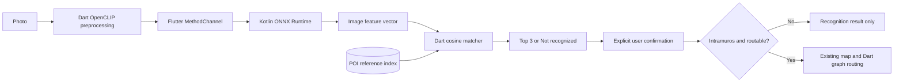

# TUNTON AI Software Design Document

**Revision:** 2.0 · **Date:** 2026-10-10 · **Status:** Reflects user-approved OpenCLIP/native Android architecture. PRD is the product authority; ARD defines files/contracts; ARCHITECTURE describes runtime sequencing.

## System

Flutter provides photo selection, candidate confirmation, and existing Intramuros navigation. OpenCLIP ViT-B/32 (`laion2b_s34b_b79k`) is exported as an image-only ONNX graph and run by native Android ONNX Runtime through a MethodChannel. Dart validates and ranks local embeddings. Python/ONNX Runtime are build-time preparation tools; there is no FastAPI, localhost server, cloud inference, or OCR.

## Scope traceability

| Requirement | Design owner |
|---|---|
| P0-01 photo capture/selection | Existing Flutter camera flow |
| P0-02 local vision inference | `embedding_service.dart`, `MainActivity.kt`, Android Gradle dependency, one ONNX image tower |
| P0-03/04 matching and uncertainty | Existing Dart matcher plus model-versioned local index |
| P0-05 confirmation | Existing recognition flow |
| POI identity/location | Verified catalog; model output cannot create coordinates |
| Intramuros route | Existing graph, map and pure Dart Dijkstra; no added-area routing |

## Data and interfaces

The native interface is a local Flutter MethodChannel call carrying one fixed-shape preprocessed float tensor and returning one float vector. It is not an HTTP API. The channel checks method name, tensor element count, model input/output metadata, and finite output. Inference calls are serialized. The Dart side performs cosine matching against an index whose `model_id`, preprocessing version, dimension and model SHA-256 match the packaged export manifest.

Catalog records require `id`, `name`, `area_id`, `lat`, `lon`; `route_node_id` is optional and only valid for graph-backed Intramuros POIs. Held-out/unknown imagery and source manifests are preparation-only and are excluded from the APK.

## Reliability and privacy

Missing/corrupt ONNX, mismatched index/model, invalid image/tensor, runtime errors, and nonfinite output return explicit recognition-unavailable states. There is no online fallback. The app retains no image beyond its recognition use and logs no pixels or embeddings. Recognition similarity is a ranking value, not a calibrated probability. Routing is a preview and available only for the existing Intramuros graph.

## Verification and evidence

First compare host OpenCLIP and ONNX output on deterministic inputs; then load and execute the same ONNX model in Android through Flutter. Verify preprocessing parity and at least one held-out match before promoting the index. Build/analyze the Flutter app and run focused data checks. A physical phone, airplane-mode operation, and 8 GB memory claim require separate measured device evidence; an emulator is not a substitute.
