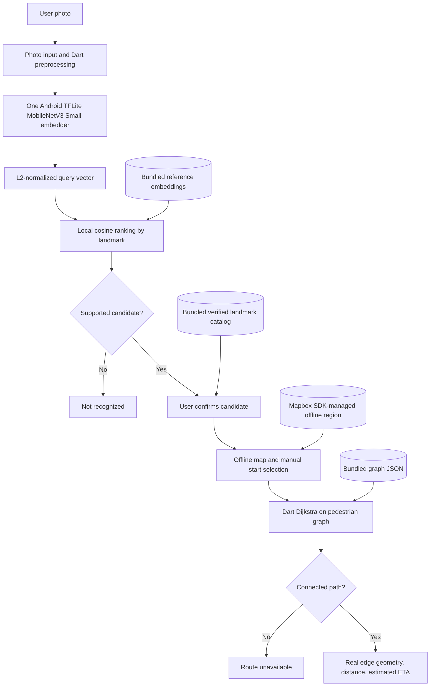

# TUNTON Software Design Document

**Revision:** 1.1 · **Date:** 2026-10-09 · **Platform:** Android-first Flutter app. **Status:** Design for the Mapbox offline-region P0 decision; SDK integration and device readiness are not yet verified.

## 1. Purpose and authority

This Software Design Document (SDD) describes how TUNTON's approved Android P0 requirements map to system components, data, runtime boundaries, failure behavior, and verification. It is a design overview for engineers and AI agents, not a second product specification.

Use the source documents in this order:

1. [`PRD.md`](PRD.md) defines product scope and acceptance.
2. [`ARD.md`](ARD.md) defines approved files, dependencies, and data contracts.
3. [`ARCHITECTURE.md`](ARCHITECTURE.md) defines the runtime sequence and boundaries.
4. [`SETUP.md`](SETUP.md) defines developer setup, asset preparation, and release verification.
5. [`AGENTS.md`](../AGENTS.md) defines coding-agent scope and change rules.

If this SDD conflicts with those documents, stop and follow the higher-authority contract. A change to P0 requirements or the approved file/package surface requires an explicit decision and updates to the governing documents.

## 2. System overview

TUNTON is a one-region Android application for recognizing supported Intramuros landmarks from a photo and previewing a local walking route. Inference, matching, and routing use local data. The app downloads the Mapbox style and fixed Intramuros region through its SDK while connected; after that download completes, the region is served from SDK-managed local storage. No runtime backend, cloud AI, database, user account, or GPS prerequisite is required.

### User journey

1. While connected, download the fixed Mapbox style and Intramuros offline region and confirm completion. Then disconnect and cold-launch.
2. Capture or choose one photo.
3. Preprocess it and run one MobileNetV3 Small image embedder on Android.
4. Compare its normalized embedding with the local reference index; produce up to three distinct candidates or **Not recognized**.
5. Require the user to confirm the destination.
6. Display the confirmed landmark on the downloaded Mapbox region.
7. Let the user select a valid graph-backed start point manually.
8. Run Dart Dijkstra over real pedestrian graph edges and display route geometry, distance, and estimated time at 4.5 km/h, or **Route unavailable**.

Recognizing a landmark identifies the depicted place; it does not locate the photographer. The result is a walking-route preview, not live turn-by-turn navigation or an access guarantee.

## 3. Scope and requirement traceability

| PRD requirement | Design responsibility | Primary approved location |
|---|---|---|
| P0-01 | Capture/select one image; report unreadable image | `lib/features/camera/photo_screen.dart` |
| P0-02 | Load one packaged model; verify tensors; infer locally | `lib/features/recognition/embedding_service.dart` |
| P0-03–04 | Rank up to three distinct IDs; preserve unknown/ambiguous outcomes | `lib/features/recognition/landmark_matcher.dart` |
| P0-05 | Require explicit destination confirmation | `lib/features/recognition/recognition_screen.dart` |
| P0-06–07 | Download/verify Mapbox offline region; render markers; select a manual graph-backed origin | `lib/features/map/offline_map_screen.dart`, `landmark_markers.dart` |
| P0-08 | Resolve coordinates and route-node ID from verified catalog | `lib/shared/models/landmark.dart`, `assets/landmarks/landmarks.json` |
| P0-09–10 | Run Dijkstra on permitted edges; preserve edge geometry; calculate length/ETA | `lib/features/navigation/routing_service.dart`, `route_result.dart`, `navigation_screen.dart` |
| P0-11 | Complete P0-01 through P0-10 after airplane-mode cold launch | Whole packaged Android application |
| P0-12 | Show truthful errors for bad images/assets/catalog entries/no path | Relevant approved screens/services |

The Python preparation pipeline supports creation and validation of bundled inputs. It is not part of Android runtime and does not by itself satisfy device acceptance.

## 4. Architecture and trust boundaries



The developer-machine preparation pipeline produces the bundled checkpoint, vectors, catalog, and graph before packaging. The Mapbox SDK downloads its basemap to private device storage while connected. At runtime, the trust boundaries are the app's bundled input assets, the SDK-managed map store, Mapbox SDK requests/telemetry, and the user's selected image. No user image leaves the device.

## 5. Component design

| Component | Responsibility and contract | State |
|---|---|---|
| App entry/state | Start the single P0 flow and hold only current photo, candidates, confirmed destination, manual origin, and route | `main.dart` is currently still the generated Flutter counter app; approved `app/app.dart` is absent |
| Photo input | Capture/select one image, show preview, report cancellation/decode failures | Target `photo_screen.dart` absent |
| Embedding service | Reuse one interpreter; preprocess one image; validate output; return finite normalized embedding | `embedding_service.dart` exists; Android device execution unverified |
| Landmark matcher | Load the bundled index, cosine-rank references, reduce to best score per landmark, return distinct candidates/unknown | `landmark_matcher.dart` exists; UI integration absent |
| Recognition confirmation | Present suggestions and require explicit confirmation | Target `recognition_screen.dart` absent |
| Offline map | Download/verify fixed Mapbox region while connected; render SDK-managed data offline with catalog markers; offer manual graph-backed start | Target map screens absent |
| Routing service | Validate node IDs; run weighted Dijkstra; reconstruct stored geometries; compute distance and ETA | `routing_service.dart` exists; screen integration absent |
| Result models | Represent verified landmark and route/unavailable result | Both approved model files exist |
| Asset preparation | Normalize/validate catalog, model index, graph, photos, and tile data | `tools/prepare_dataset.py` exists; developer-machine only |

Use the existing ARD structure. Do not add another state framework, repository/use-case layers, runtime service, model adapter hierarchy, or unrelated architecture directories.

## 6. Android runtime and platform design

- **Target:** Android release APK on a physical device. Android API 26+ is the documented minimum for the selected TFLite Flutter package setup. iOS is not a P0 target.
- **Image input:** approved `image_picker`; decode and preprocess using the approved Dart `image` package and the verified model tensor contract.
- **Inference:** `tflite_flutter`, one interpreter, one image at a time, CPU-first. Do not fetch model files or initialize a second model.
- **Map:** `mapbox_maps_flutter` with SDK-managed offline style and region downloaded while connected; no online fallback after setup and no Mapbox data packaged in the APK. Keep Mapbox attribution visible; also attribute OSM-derived pedestrian graph data.
- **State:** `flutter_riverpod` for only the current P0 flow state, as allowed by ARD.
- **Location:** no GPS or EXIF-based geolocation. The start point is manually selected and must resolve to a graph node; EXIF orientation may still be applied during image preprocessing.
- **Permissions:** request only what image capture/selection needs through the approved platform/package behavior. Do not add location, background, or network permissions for excluded features.
- **Memory:** avoid decoding reference photos as a batch; retain the short embedding index; release image/intermediate buffers where possible. The 8 GB target remains unproven until measured on an actual device.

The exact checkpoint URL/hash, tensor dimensions, preprocessing, JSON fields, and route geometry convention are defined in `AGENTS.md` and `ARD.md`; those documents are authoritative.

## 7. Data and interfaces

The runtime interfaces are packaged files, not HTTP endpoints:

| Asset | Runtime use | Integrity requirement |
|---|---|---|
| `assets/models/landmark_embedder.tflite` | Local embedding inference | Exact approved checkpoint; inspect real Android input/output tensors |
| `assets/landmarks/reference_embeddings.json` | Local candidate ranking | Same model/preprocessing; finite normalized vectors at actual output dimension |
| `assets/landmarks/landmarks.json` | ID-to-name/coordinate/route-node lookup | Unique IDs, verified coordinates, valid graph-backed node IDs |
| `assets/maps/intramuros_graph.json` | Walking route search | Valid directed pedestrian edges, positive finite lengths, real `[lat, lon]` geometries |
| Mapbox SDK offline store | Offline map rendering | Region/style download completed and covers the pilot region; no app-level redistribution |
| `assets/images/` | Licensed reference images defined by the ARD asset contract | Per-image provenance; evaluation-only images remain outside this path |

Landmark IDs are the join key between recognition and routing. Model outputs may rank a known ID, but only the verified catalog supplies coordinates and route-node IDs. Graph distances come from `length_m`; route polylines come from ordered edge geometries, never straight-line interpolation.

Preparation inputs and evaluation artifacts live under `test/datasets/`. Their schemas, source provenance, split rules, and generation sequence are specified in `ARD.md`, `SETUP.md`, and [`TUNTON_BACKEND_STRUCTURE.md`](TUNTON_BACKEND_STRUCTURE.md).

## 8. Offline behavior, errors, and safety

| Condition | Required behavior | Forbidden behavior |
|---|---|---|
| Image cancelled, unreadable, or unsupported | Keep/return to photo selection and show a clear error | Crash or infer from stale image state |
| Model missing/incompatible or bad embedding | Show recognition unavailable | Cloud inference, random vector, false candidate |
| Unknown or ambiguous photo | Show **Not recognized** or ranked candidates requiring confirmation | Invent a coordinate or confidence probability |
| Candidate not confirmed | Do not start route calculation | Silently select top candidate |
| Catalog ID/node invalid | Show unavailable location/data state | Guess nearest building centroid |
| Mapbox region missing/incomplete | Show map not ready and offer connected region download | Fall back to online tiles or claim offline readiness |
| Graph endpoints disconnected | Show **Route unavailable** | Straight-line route substitute |
| Static data may be stale for gates/closures | Label output as route preview and preserve limitation | Claim current access or safety guarantees |

P0 has no login, app-owned analytics, cloud inference, remote database, arbitrary dynamic assets, or photo upload. The fixed Mapbox map region is downloaded through its SDK while connected. Mapbox SDK may send de-identified usage/location telemetry under its terms; retain the attribution control so users can access its telemetry opt-out. Preserve attribution and redistribution restrictions for photo/map data. Treat bundled and generated inputs as data to validate; never silently repair a bad coordinate, vector, or edge into a plausible-looking result.

## 9. Build, packaging, and release design

1. Prepare and review the approved data/model/map assets on the developer machine using `tools/prepare_dataset.py`.
2. Register actual bundled asset files in `pubspec.yaml`; do not register Mapbox map data or evaluation data.
3. Configure the scoped public Mapbox token through build configuration, build and inspect the Android app. A successful build alone is not release acceptance.
4. Install the release APK on a physical Android device and download the fixed Mapbox style/region while connected.
5. Confirm region completion, enable airplane mode, ensure both Wi-Fi and mobile data are disabled, cold-launch, and exercise the complete photo-to-route journey without a connected Mac service.
6. Record device model, Android version, installed RAM, inference/route timings, memory, failures, and exact test result.

There is no server deployment, backend environment configuration, API secret, or migration step for P0.

## 10. Verification strategy

### Local checks

Use the focused test files already present for their corresponding contracts:

- Dart: `test/embedding_service_test.dart`, `test/preprocessing_parity_test.dart`, `test/landmark_matcher_test.dart`, `test/landmark_test.dart`, `test/routing_service_test.dart`, and `test/route_result_test.dart`.
- Python preparation: `test/prepare_dataset_*_test.py` with temporary fixtures for CLI/schema, provenance, map/tile, and boundary behavior.
- App-level: Flutter widget/integration tests after the approved screens exist.
- Required repository gates before submission: `flutter pub get`, `flutter analyze`, `flutter build apk --release`.

Run the Dart suite with `flutter test` and the Python preparation suite with:

```bash
for test_file in test/prepare_dataset_*_test.py; do
  .venv/bin/python "$test_file" || exit 1
done
```

Passing host tests do not prove Android TFLite inference, release installation, airplane-mode operation, or 8 GB memory fit.

### Physical Android acceptance

- Supported held-out photo (not a reference duplicate) ranks its landmark among the top three.
- Out-of-catalog input can produce **Not recognized** with no fabricated location.
- Confirmed destination and manual graph-backed origin create a route following stored edge geometry.
- Disconnected pair produces **Route unavailable**.
- Missing/malformed model, catalog, index, graph, or tile data fails visibly without network fallback.
- Full release flow works after airplane-mode cold launch.
- Memory and latency are measured on the actual device; identify compatibility as unverified when an 8 GB device was not measured.

## 11. Current implementation status (checkout inspection, 2026-10-09)

File presence and asset counts below are inspection results only; they are not test or readiness claims.

| Area | Observed checkout state |
|---|---|
| App entry | `lib/main.dart` remains the generated Flutter counter starter |
| Dart services/models | Embedding, matching, routing, and two shared models are present; approved screen/app files are absent |
| Runtime dependencies | `image` and `tflite_flutter` are declared; the remaining ARD-approved app packages are not yet declared |
| Data assets | Six catalog records, 23 reference photos/vectors (dimension 1024), 3,268 graph nodes, 7,245 directed edges, and 156 legacy OSM-rendered tile files are present; these tiles do not establish Mapbox readiness |
| Model file | Present; inspected SHA-256 is `bbbb4c51a55a53905af1daec995ca1aae355046f8839bb8c9f5ce9271394bc40` |
| Full P0 journey | Not implemented in the current app entry; Android release and airplane-mode acceptance are not established by file presence |
| 8 GB device target | Not measured in this inspection |

Refresh this section when the checkout changes. Keep observed repository state separate from the ARD-approved target tree.

## 12. Decisions, exclusions, and open proof

### Locked decisions

- Android-first Flutter app; one Intramuros coverage pack; one local MobileNetV3 Small image embedder.
- Bundled read-only model/catalog/graph data and pure Dart routing; no app server. The initial Mapbox offline-region download needs internet.
- Manual start selection, explicit destination confirmation, three distinct candidates maximum, honest unknown/no-path states.
- User photo stays on device and no user identity is collected. Mapbox SDK may send de-identified telemetry under its terms; the user opt-out is exposed in the visible attribution control.

### Explicit exclusions

Worldwide/street-scene recognition, GPS/EXIF-based geolocation, saved locations/accounts, online routing, turn-by-turn/automatic rerouting, traffic/closure data, OCR/LLM, second model, remote service, and additional platform/geographic packs. Mapbox basemap and its one connected offline-region download are in P0 scope.

### Proof still required

Actual Android model inference and tensor evidence; full screen integration; Android release build/install; physical airplane-mode cold launch; held-out/unknown device behavior; connected/disconnected route cases; and measured memory/latency on an 8 GB device or an explicit statement that target compatibility is unverified.

## 13. SDD traceability

| Design topic | Governing detail |
|---|---|
| Requirements and acceptance | [`PRD.md`](PRD.md) |
| Approved files, packages, schemas, and model contract | [`ARD.md`](ARD.md) |
| Runtime sequence and system boundaries | [`ARCHITECTURE.md`](ARCHITECTURE.md) |
| Developer setup and acceptance procedure | [`SETUP.md`](SETUP.md) |
| Backend/data asset generation | [`TUNTON_BACKEND_STRUCTURE.md`](TUNTON_BACKEND_STRUCTURE.md) |
| Current files and task boundaries | [`DEVELOPMENT_MAP.md`](DEVELOPMENT_MAP.md) |
